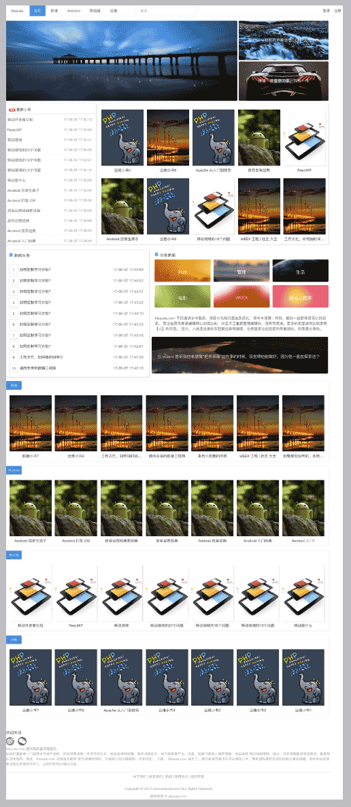
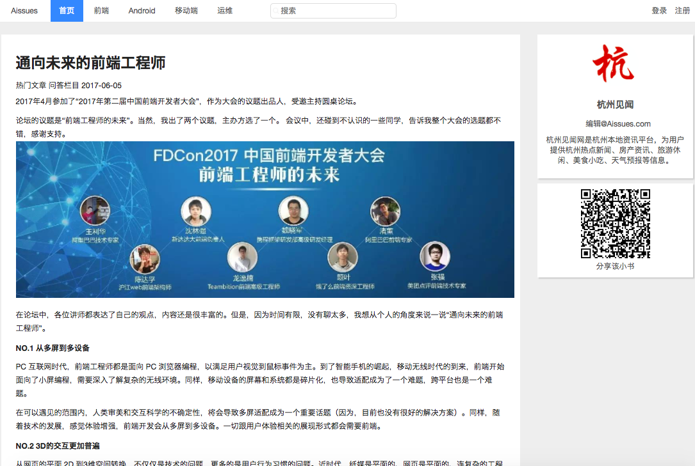
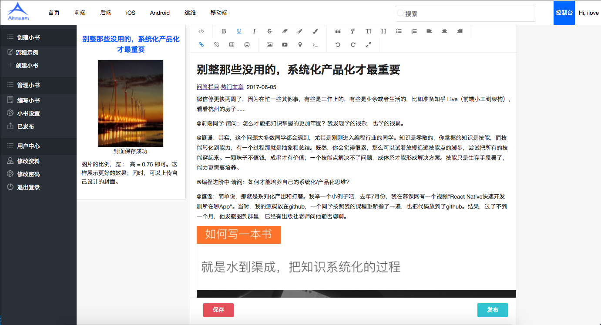
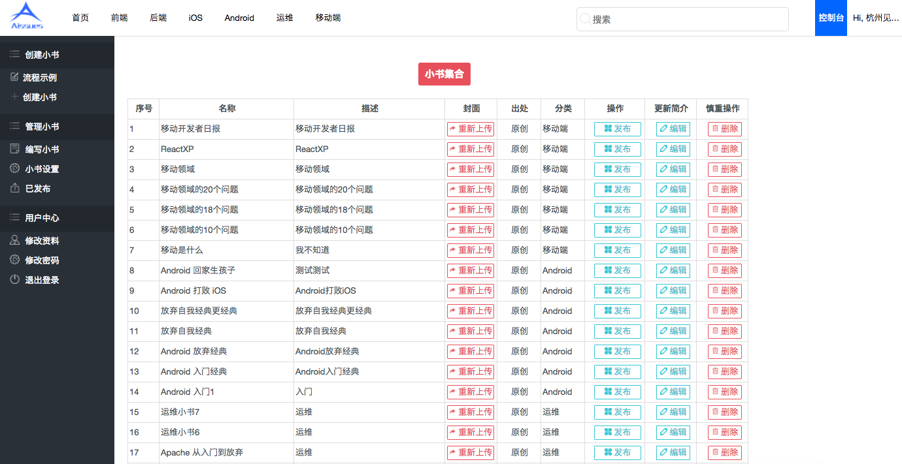
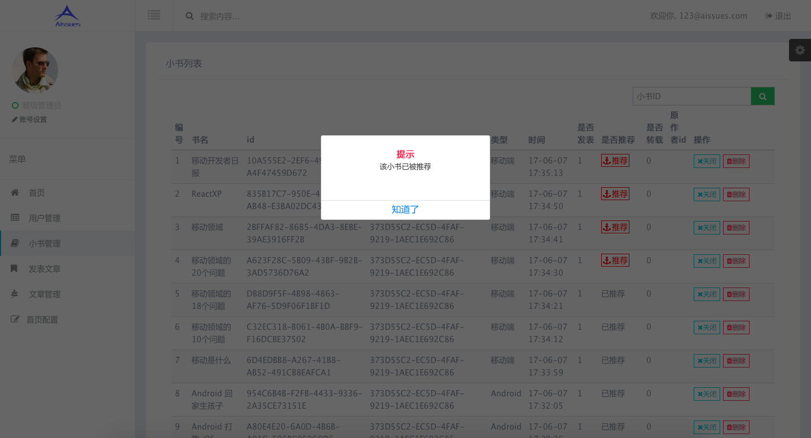

## 前言
请关注 [网站:簋谣的世界](http://t.aissues.com/tag/xiao-shu-wang-zhan/), 会整体介绍项目架构和项目细节。也有刚写 PHP 的一些感受和完成整个产品的思考。

## 为什么这个项目叫 Aissues
因为自己是码农，所以干脆取了「issue」之意。也寓意自己可以像「一休」一样思考。所以读作「额，一休」。😔需要停顿，所以多了「额...」。

## 项目的由来
同时，我想把 Aissues 取一个中文名称，所以简单叫做「小书网站」吧。  

小书，顾名思义，就是一本小小的书，类似于二三十页的 PDF。16 年的时候，觉得目前网络上知识太碎片化了，不系统。读一本技术书又太耗时，不能立即运用到项目中。所以想，能否找到一个中间状态。那就是小书。

想了一段时间，觉得方向是对的。有一次出差到北京，还专门请教了出版社的老师朋友们。他们也觉得可行。所以，2016 年，就花了零零散散不到2周多的时间用 PHP 写了一个小书网站的雏形。

但是，发现这样系列知识的创作是很有难度的。且不说，一个人一年能输出多少有价值的内容；况且还需要找一批志同道合的人来一起创作。所以，项目完成后，基本上算是放弃运营了。

目前市面上，有专门做付费内容的，并且是以文章的形式，就是 gitchat 团队。之前我是不知道有 gitchat 这个团队的，否则我就不做这件事了。

有3点我是比较欣赏和认同他们的做法：

1.采用文章形式，而非视频。目前网络教学视频太多，而用户的时间很少。文章显然更高效。这一点也是我做「小书网站」的初衷。

2.重运营。发动技术社区牛人参与进来。这一点也只有@谢工有强大的资源整合能力。他们初期也邀请我去讲一次，但是一直没有什么好话题，就搁浅了。不得不佩服 gitchat 在技术社区的运营能力。

3.控制文章篇幅。现在看来 gitchat 文章篇幅是一个理想状态。我对「小书网站」的初衷也是如此。不能太短，否则用户知识体系不系统。但是也不能太长，否则跟看本书没什么分别。用户时间太宝贵～

在「小书网站」试运营初期，感谢@young、@友伟、@小潘、@晓明等同学的支持，不仅帮助开发各端代码，也帮助运营了一些内容。

人总是要尝试，才能知道自己“几斤几两”。不过，话说回来，这个项目完成后，还是有一些东西可以总结的。

因此，该代码分享出来，尽管做为一个前端写的很挫，连 PHP 门都没入的人。

## 项目概况
该项目大概总体开发时间 1-2 周。本人对 PHP 了解不多，大概只正儿八紧学习了 2 周不到的时间。但是因为有一点的后端基础。所以完成一个项目来说已经足够了。如果要给我自己的 PHP 能力打分，真的只能算入门。初级都不到。

所以，总体而言，如果对 PHP 一无所知，完全可以通过该项目，学会开发自己的 Web 应用。也希望给大家带来一点点思考和借鉴。并且我认为掌握哪一门语言不重要，因为大家的学习语言的速度都很快。

这里选择 PHP，是因为我想练习下 PHP，也是为后面自己能够修改那么多开源 PHP 系统而准备。当然，该项目中的 PHP 知识非常简单。

其实，完成项目是次要的。我希望通过该项目表达两点： 
1. 完全独立开发一个网站，包括前后端并没有想象中那么难？ 
2. 拥有开发整个产品的能力，掌握产品研发体系才是最重要的。

### PC 网站展示
##### 用户端首页
      

#### 小书详情
    

#### 小书编辑    
    

#### 用户小书管理    
    

#### 管理员后台    
     

#### 其他
其实，还有很多其他功能的，比如用户管理、小书推荐管理、新闻发布、分类展示等等。同时，还提供 H5 文章分享等。  

## 更多
请关注 [网站:簋谣的世界](http://t.aissues.com/tag/xiao-shu-wang-zhan/), 会整体介绍项目架构和项目细节。也有刚写 PHP 的一些感受和完成整个产品的思考。
